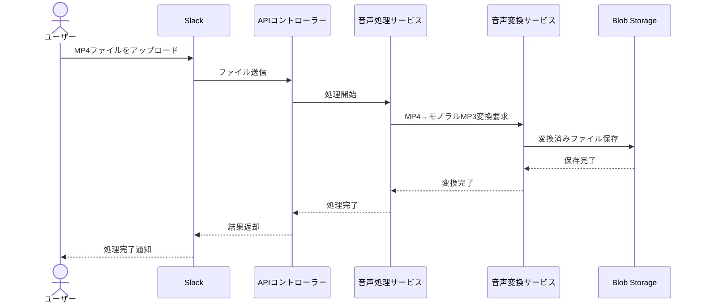

# システムパターン: 分析

## 音声解析 API

### アーキテクチャ概要



## アーキテクチャ設計原則

### 1. バーティカルスライス

本プロジェクトではバーティカルスライスアーキテクチャを採用します。このパターンの主な特徴は：

- 機能ごとに独立した「スライス」としてモジュール化
- 各スライスは自身のレイヤー（コントローラー、サービス、モデル）を保持
- 機能間の境界を明確にし、結合度を低く保つ

```
┌─────────────┐  
│ ファイル処理  │
├─────────────┤
│ コントローラ  │
├─────────────┤
│ サービス     │
├─────────────|
│ モデル       │
└─────────────┘
```

### 2. クリーンアーキテクチャ

各機能スライス内では、クリーンアーキテクチャの原則に従います：

- **依存関係の方向**: 外部から内部へ（インフラ → インターフェース → ユースケース → エンティティ）
- **依存性逆転の原則**: インターフェースを利用して依存方向を制御
- **ビジネスルールの独立性**: コアロジックをフレームワークや外部ライブラリから独立させる

```
┌───────────────────────────────────────────┐
│              エンティティ                  │
│ (ビジネスルールとデータモデル)              │
└───────────────┬───────────────────────────┘
                │
┌───────────────▼───────────────────────────┐
│            ユースケース                    │
│ (アプリケーション固有のビジネスルール)       │
└───────────────┬───────────────────────────┘
                │
┌───────────────▼───────────────────────────┐
│          インターフェースアダプター          │
│ (コントローラー、プレゼンター、ゲートウェイ)   │
└───────────────┬───────────────────────────┘
                │
┌───────────────▼───────────────────────────┐
│          フレームワークと外部ツール          │
│ (データベース、フレームワーク、UI、Web等)     │
└───────────────────────────────────────────┘
```

### 3. CQRS (Command Query Responsibility Segregation)

状態を変更する操作（コマンド）と情報を取得する操作（クエリ）を分離します：

- **コマンド**: ファイルアップロード、変換処理開始など
- **クエリ**: 処理状況確認、結果取得など

この分離により、それぞれの処理を最適化し、システムの拡張性と保守性を向上させます。